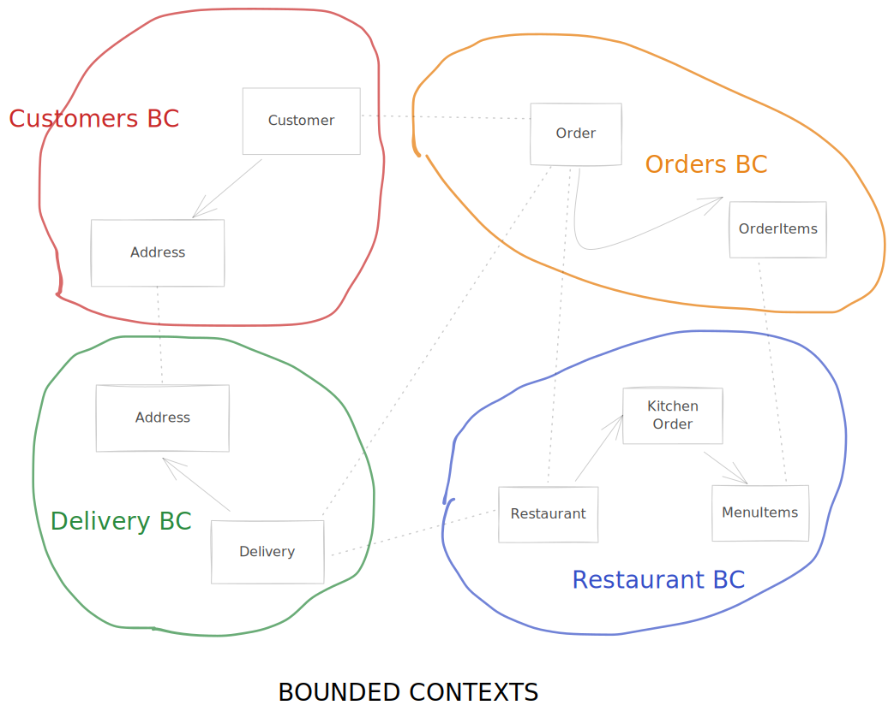
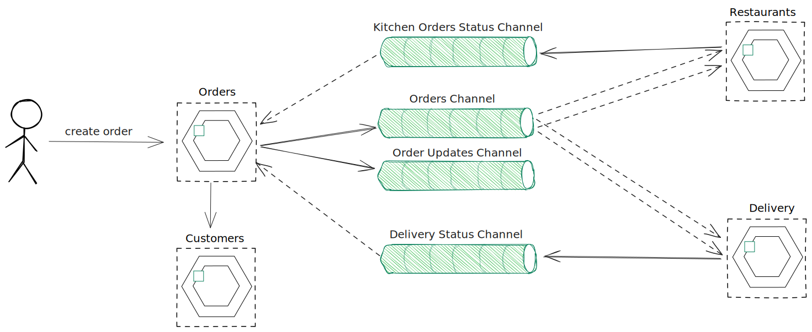
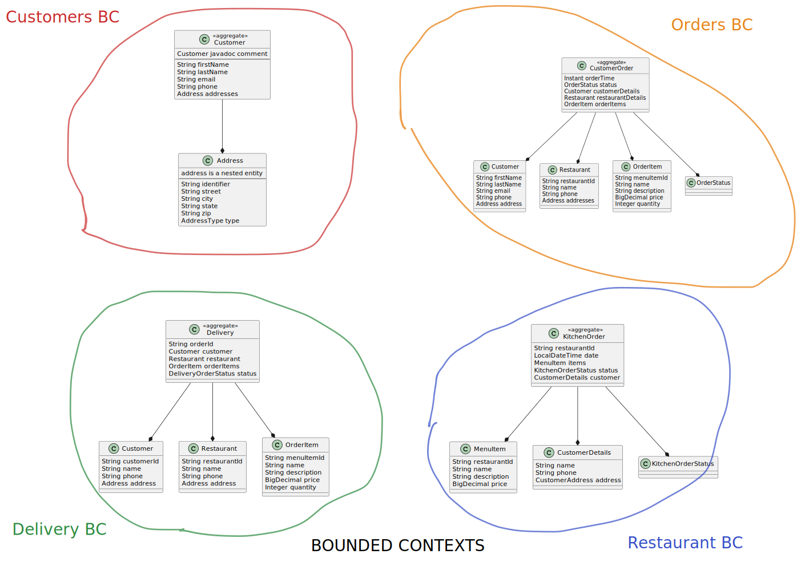

# Food Delivery Service with SpringBoot Microservices + AsyncAPI v3

SpringBoot Microservices for a "Food Delivery Service" for a AsyncAPI Technical Talk @sngular


## Online Food Delivery Service

### Getting Started

After cloning the repository, you can build and run the application using:

```shell
docker-compose -f modulith/src/main/docker/docker-compose.yml up -d
mvn spring-boot:run -f modulith
```
The use REST APIs to create/update `customers`, `restaurants` and `orders`.

### Bounded Contexts


### APIs

#### AsyncAPI:

* [customers/src/main/resources/apis/asyncapi.yml](customers/src/main/resources/apis/asyncapi.yml)
* [delivery/src/main/resources/apis/asyncapi.yml](delivery/src/main/resources/apis/asyncapi.yml)
* [restaurants/src/main/resources/apis/asyncapi.yml](restaurants/src/main/resources/apis/asyncapi.yml)
* [orders/src/main/resources/apis/asyncapi.yml](orders/src/main/resources/apis/asyncapi.yml)

#### OpenAPI:

* [customers/src/main/resources/apis/openapi.yml](customers/src/main/resources/apis/openapi.yml)
* [delivery/src/main/resources/apis/openapi.yml](delivery/src/main/resources/apis/openapi.yml)
* [restaurants/src/main/resources/apis/openapi.yml](restaurants/src/main/resources/apis/openapi.yml)
* [orders/src/main/resources/apis/openapi.yml](orders/src/main/resources/apis/openapi.yml)

### Create Order Async Channels




### Bounded Contexts Entities


